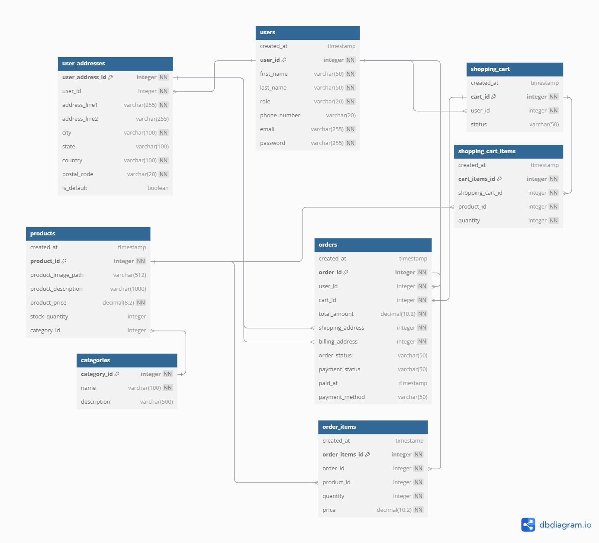

# PenPal Market


## Project Description

**PenPal Market** is a _full-stack eCommerce store_ designed to showcase a premium selection of pens as writing instruments. This project is a collaborative effort to build a **complete online store** experience, covering everything from _ideation and UI/UX design_ to _backend and frontend development_. The store offers a carefully curated range of pens, catering to both practical users and luxury collectors.

In pursuit of simplicity and maintainability, we prioritize a **minimalistic approach to dependencies**, adhere to a **Test-Driven Development** (TDD) methodology, and maintain a well-organized project structure grouped by **feature domains** — "products", "users" etc:. (as opposed to grouping technical layers together — "routes", "services", etc:.).

This document serves as a guide to all aspects of the project.

**WIP**

## Quickstart

1. Clone this Repo

2. Create a MySQL database and seed it with data using backend/database/fresh_db.sql

3. Use .example-env to create an .env with your / the correct values

4. Run the project

```bash
cd backend
npm run start-ts
```

---

## Backend

### Database Setup

There needs to be a **database setup** for this project. You can set it up / manage it with whatever software as you prefer, but below are some steps. To follow them, make sure you have downloaded and installed [MySQL](https://dev.mysql.com/downloads/installer/).

1. Open up a command line (as admin) and start MySQL Server

```bash
net start mysql
# net stop mysql # >>> to stop services
```

2. Log in to MySQL as the root user (or another), add "use mysql;" if need be

```bash
mysql -u root -p # use mysql;
```

2.5. (OPTIONAL) Manage the connection with either [MySQL Workbench](https://dev.mysql.com/downloads/installer/), the [Database Client JDBC](https://marketplace.visualstudio.com/items?itemName=cweijan.dbclient-jdbc) VSC extension, or other sofware of choice. Make sure to establish the connection with the right credentials: check the .example-env file.

**Defaults:**
**user**: _root_
**host:** _localhost_
**port:** _3306_

3. Create and Seed the database. Appropriate Queries are provided in database/utility. You can do _both_ of these things by running **fresh_db.sql**, or step by step:

   **3.1** Run **create_db.sql** to create the database

   **3.2** Seed it with the provided data with **seed_db.sql**

---

#### API Setup

On the project:

1. Navigate to the backend dir

```bash
cd backend
```

2. Start the API

**Run | dev** (no transpiling):

```bash
npm run start-ts
```

**Run | prod**:

```bash
npm run build
npm run start
```

### JWT and Authentication

Some routes are protected. You need to be logged in, and have a valid access token (JWT). We're using the official plugins _@fastify/jwt_ to generate and verify JWT and _@fastify/cookie_ to read and set cookies. We're also using a Fastify preHandler hook (that runs before the actual route).

Check out _app.ts_ for the implementation. In users > _userRoutes.ts_ you can see the /login route, where after a successful login (check out _userService.ts_) we generate a valid token and set a cookie with it that will be sent with every request, and will be read when necessary.

Make sure to set a **JWT secret** and a **Cookies secret** in your **environment variables**. Check out the file _.example-env_

This article was a very nice help, especially with Typescript: https://medium.com/@atatijr/token-based-authentication-with-fastify-jwt-and-typescript-1fa5cccc63c5

#### Protected Routes

**WIP**

These are the routes that need a valid access token / bearer token, and where we use the preHandler hook to check it.

There are **currently** 2 authentication levels: authenticate and authenticate_self. While the first needs the user to only be logged in, the second demands that the id present in the request (for example, to delete a user, the user id sent with the route) matches the id present in the decoded jwt that's in the access_token cookie. Check implementation in \_app.ts\*.

_Admin only authentication level TBA._

```bash
const { id } = req.params as { id: string };

const token = req.cookies.access_token;

// verify authenticity too!
const decoded = req.jwt.verify<FastifyJWT['user']>(token);

// second level, "authenticate_self"
if (decoded.id != id) {
	throw new UnauthorizedError('Request ID and User ID mismatch.');
}
```

### Tests

We utilize Fastify's built-in testing method, [inject()](https://fastify.dev/docs/v1.14.x/Documentation/Testing/) — which injects fake http requests, along with Node's native assertion and testing modules, to validate our backend API. We intend to use a TDD approach where we write tests before the actual implementation, refactoring as needed.

To run tests:
**make sure you are in the backend directory and your database is seeded with fresh data**

```bash
npm run test # all tests
# tests by groups
npm run test_users
npm run test_products
npm run test_orders
# TBA --
```

To drop the database, re-create it and seed with fresh data again, you can use the query present in:
database/utility/**fresh_db.sql**
_(or do it manually)_

On _database/json_mocks_ you can find some useful json with example values to create/update a user or product, etc:. These are used on the tests, but can also be used for practicality for testing endpoints manually using a tool like Postman, etc:.

#### Isolation

When NODE_ENV=test, the database connection is different. Check \_database/testConnection.ts\*. Before each test, we do a database transaction to isolate it. Then, we rollback that change. This way, each test is independent.

```bash
import connection from '../database/dbConnection';

beforeEach(async () => {
	connection.promise().query('START TRANSACTION');
	// we also seed user data to rollback later here!
});

afterEach(async () => {
	connection.promise().query('ROLLBACK');
});
```

We also seed a test user. **Check _tests/testHelpers.ts_.**

**Test User:**

```
{
	"email": "test@user.com",
	"password": "TestPassword1#",
}
```

### Database

We're using a MySQL database and **MySQL2**, a modern and lightweight library, to interact with it.

When using Typescript + CRUD operations with MySQL2, the query result includes a ResultSetHeader with query metadata you should use.

Refer to the [official docs](https://sidorares.github.io/node-mysql2/docs/documentation/typescript-examples#resultsetheader) on ResultSetHeader.

Example — createProduct function on productService.ts

```bash
export const createProduct = async (product: Product): Promise<Product> => {
	# ...
	try {
		const [result] = await connection.promise().query<ResultSetHeader>(sql, [name, description, price, category, stock]);

		# ...

		return newProduct;
	} catch (err) {
		throw new Error(`Error creating product: ${err}`);
	}
};
```

#### Database Schema

Database Schema designed with https://dbdiagram.io/. Subject to changes.


### Project Structure

#### Folder Organization

**backend**

```bash
backend/
├── database/ # mock data, useful sql queries, db connection
├── src/
│ ├── products # all products related functionality
│ │ └── productRoutes.ts # route handler (api endpoints) according to type
│ │ └── productService.ts # services as needed
│ │ └── productTypes.ts # type definitions
│ │ └── ....
│ ├── .... # feature domains as needed
│ └── app.ts # configuring the fastify instance, registering routes
│ └── index.ts # starting the server
├── tests # all needed tests for the endpoints and related utility
├── package.json
└── tsconfig.json
```
